# Optimization의 큰 틀

> 학회에서 발표했던 내용 중 일부분 좀더 상술하기 위한 글입니다. 원본 슬라이드는 아래 첨부했습니다.

<br/>

우리는 배울 때, 얼마나 틀렸는지를 알아야 합니다. 그래야 얼만큼 고칠지를 알 수 있습니다. 정답지랑 비교해서 얼마나 틀렸는지를 통해 학습을 진행합니다. 따라서 **최대한 틀리지 않게** 학습해야 합니다. 딥러닝도 마찬가지입니다. 여기서 최대한 틀리지 않는다는 것은 바로 **loss를 최소화**한다는 의미와 같습니다. 결국 우리는 어떤 **loss function의 최솟값**을 찾는 것을 목표로 합니다.

  


흔히 loss function에서 최솟값을 찾아나가는 과정을 산에서 내려오는 것에 비유합니다. 우리는 적절한 오솔길이든 계곡길이든 어떤 길을 찾아 산 아래로 내려오고 싶어하는 상황입니다. 어떤 방향으로 얼마만큼 가면 산을 잘 내려올 수 있을지에 대한 질문으로 gradient descent는 시작합니다.


## The idea of Gradient descent

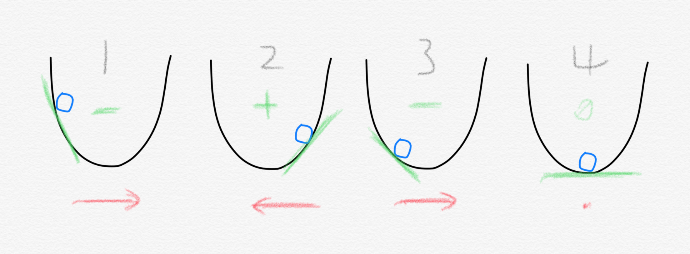

방법은 매우 간단합니다. 그 순간의 loss function의 기울기를 구합니다.  여기서는 단순하게 loss function이 2차원 포물선이라고 가정하겠습니다. 만약 기울기가 음수라면 공을 x축 방향 오른쪽으로 이동하면 됩니다. 반대로 기울기가 양수라면 공을 왼쪽으로 이동하면 됩니다. 이렇게 각 스텝마다 기울기를 구해서 그 부호에 맞게 이동하다 기울기가 어느덧 0인 지점에 도달하면 우리는 loss function의 최솟값에 도달한 셈입니다. 이를 대략적으로나마 수식으로 표현하면 이렇습니다. 


$$
w_{t+1} = w_t - \gamma \cdot \nabla L(w_t)
$$
<br/>

음수일 때 오른쪽으로 이동(w는 무언가를 (+)더함)하고 양수일 때는 왼쪽으로 이동(w에서 무언가를(-)뺌)하는 것은 기존 $w$에서 무언가를 빼주는 것으로 표현할 수 있습니다. $\nabla L(w_t)$ 는 **기울기(gradient)**라고 일단 생각하시면 편합니다. 그리고 여기서 $\gamma$ 로 표현된 것은 얼만큼 학습할지 또는 산을 내려가는 비유에서는 **한 걸음 보폭을 얼만큼으로 할지**를 나타내는 **learning rate**입니다. 기울기가 0이 되면 $w$는 더이상 변하지 않게 됩니다. Gradient descent 알고리즘이 그리는 대략의 큰 그림은 이런 방식입니다. 우리의 모델이 트레이닝 데이터셋 전체에 대해 loss를 구하고는 이렇게 weight vector들을 업데이트 하는 것입니다. 하지만 여기서 우리가 무심코 지나쳐서는 안 되는 부분이 있습니다. 바로 "트레이닝 데이터셋 **전체**에 대해 loss를 구하고는" 이 부분입니다. 이를 가장 기본적인 **Batch gradient descent**라고 합니다.

  

## Batch Gradient descent: BGD

```python
for i in range(m):
	gradient=evaluate_gradient(training_data)
	weight=weight-learning_rate * gradient
```

전체 데이터셋을 한 번 다 본 후에 loss를 구해서 weight를 업데이트하는 방법입니다. 그리고는 업데이트 하고는 수정된 weight로 전체 데이터셋에 대해 또다시 loss를 구하고는 weight를 업데이트 하기를 반복합니다. 이를 비유하자면 아래 그림과 같습니다.

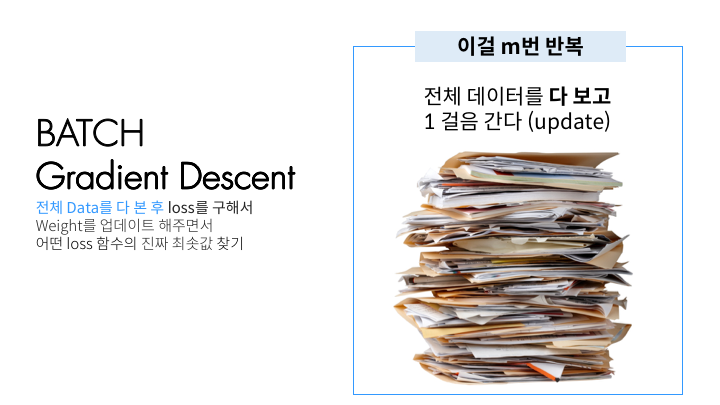

데이터 한 개를 파일 한 개라고 비유해보면, BGD는 모든 파일을 다 손에 들고는 그 모든 것을 다 고려한 최적의 한 걸음을 갑니다. 그리고는 이를 m번 반복해서 최종적으로 optimum에 도달하는 방식입니다. 하지만 상상만 해봐도 그렇듯이 저 많은 파일 뭉치를 다 손에 들고 있기란 굉장히 힘들고, 모든 것을 다 고려하려면 굉장히 시간이 오래 걸립니다. 컴퓨터도 마찬가지입니다. 저 많은 데이터를 다 메모리에 들고 있을 수 없고, 모든 것을 다 고려한 update는 시간이 많이 걸립니다. 그래서 나온 방법이 Stochastic Gradient Descent입니다.

   

## Stochastic Gradient Descent: SGD

```Python
for i in range(m):
	np.random.shuffle(training_data)
	for one_data in training_data:
		gradient=evaluate_gradient(one_data)
		weight=weight-learning_rate * gradient
```


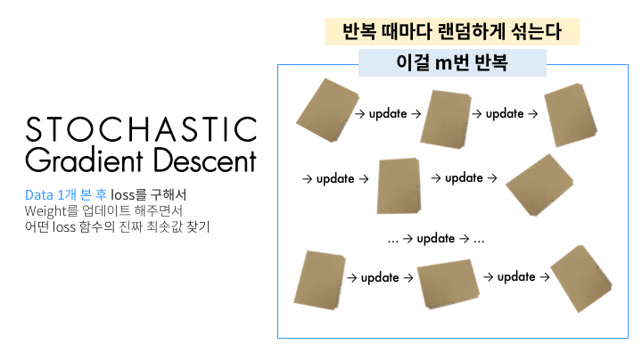

**데이터 1개**를 본 후에 바로 그거에 대해 weight update(한 걸음 가는 것)를 합니다. 그 다음 데이터를 보고는 또 이것에 대해 weight update를 합니다. 이를 전체 트레이닝 데이터셋에 있는 모든 데이터에 대해 1번씩 합니다. 그러면 트레이닝 데이터셋의 데이터 개수인 총 n번 update가 이루어집니다. 그리고는 데이터셋을 **랜덤하게 섞습니다(shuffle)**. 그리고는 또다시 트레이닝 데이터셋에서 1개씩 데이터를 보면서 update를 해나갑니다. 그러면 전체 데이터셋을 1바퀴 돌 때마다 랜덤하게 shuffle을 해주기 때문에 각기 다른 순서로 update가 이루어집니다. 이렇기 때문에 **stochastic(randomly determined)**이라는 이름이 붙습니다. 하지만 저 수많은 데이터들을 1개 보고 업데이트 하고 1개 보고 업데이트 하는 것은 보기만 해도 지칩니다. 그래서 적절히 절충한 방법이 등장합니다. 바로 Mini-batch Gradient Descent입니다.

  

## Mini-batch Gradient Descent

```Python
for i in range(m):
	np.random.shuffle(training_data)
	for one_batch in get_mini_batches(training_data,one_batch_size=32):
		gradient=evaluate_gradient(one_batch)
		weight=weight-learning_rate * gradient
```

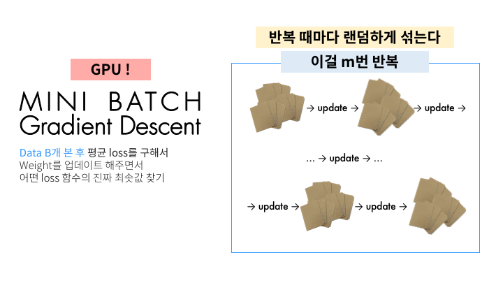

이 방법은 보다시피 데이터 1개를 보고 바로 업데이트를 하는 것이 아니라, 데이터 $B$개(하나의 mini-batch)를 본 후에 update가 이루어집니다. 이 방법은 앞선 두 방법을 적절히 버무려서 두 가지 장점을 다 취하는 것도 있지만, 다른 좋은 장점이 하나 더 생깁니다. 바로 병렬처리입니다. Mini-batch간의 loss를 구하고는 평균을 내서 update를 하게 되는데, 잘 처리하면 이 각 mini-batch에 대해 병렬처리가 가능하여 GPU가 도움을 줄 수 있습니다. 요즘은 Mini-batch Gradient Descent가 굉장히 보편화되어서 SGD라는 용어가 Mini-batch Gradient Descent를 의미하는 경우가 많습니다. 따라서 이 글 아래부분에서 SGD는 기본적으로 Mini-batch Gradient Descent를 가리키는 것으로 약속하겠습니다.

  

## Gradient descent에서의 문제 상황

이렇게 계곡길, 오솔길을 찾아 내려가는 방법이 언뜻 모든 문제를 해결해줄 것 같지만 불행히도 문제 상황들이 발생합니다. 왜냐하면  실제 현실에서의 loss function은 이렇게 깔끔한 포물선인 경우가 없기 때문입니다. 깔끔하지 않다는 뜻은 변수가 굉장히 많고, 기울기가 0인 지점이 한 군데가 아님을 나타냅니다. 그림을 보면 이해가 편합니다.

<br/>

### 군데군데 존재하는 함정들

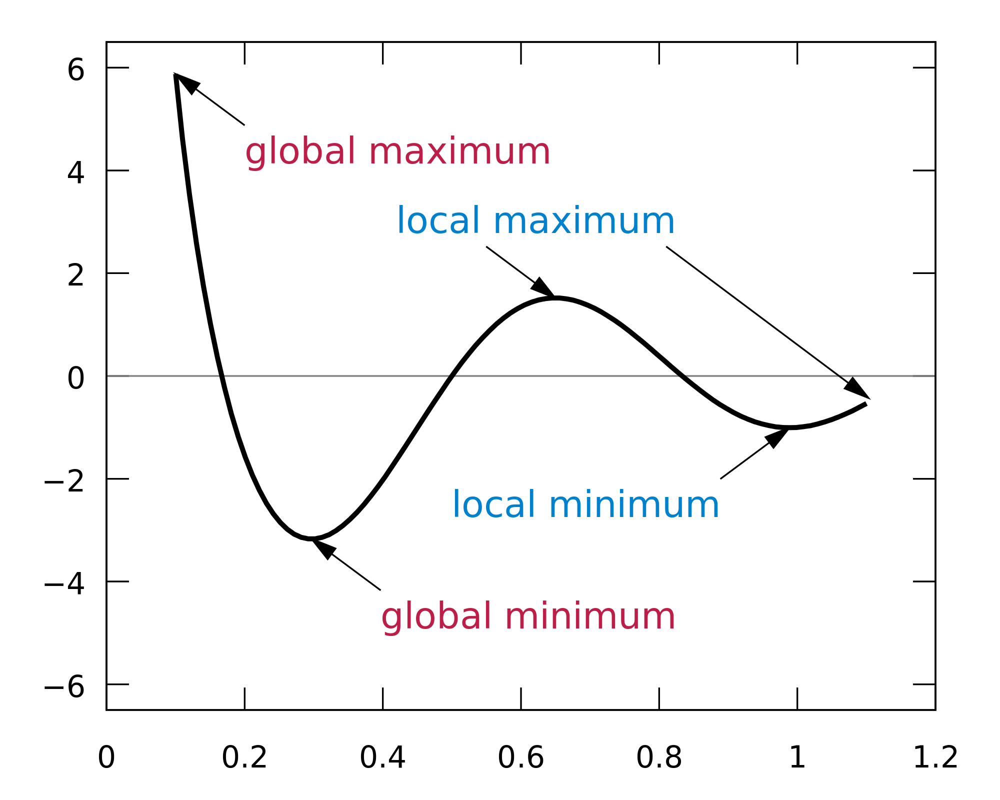

여기서 기울기가 0이 되는 minimum은 두 군데입니다. 우리가 정말로 바라는 진짜 최솟값은 global minimum입니다. 하지만 local minimum을 global minimum이라고 착각하고 여기에 안주하게 되는 일이 벌어질 수 있습니다.라고 수많은 블로그 글에서 이야기하곤 합니다. 이렇게 2차원에서는 local minimum에 갇히는 일이 주된 문제일 것 같지만 사실 고차원에서는 **saddle point(안장점)**가 더 문제입니다. 왜냐하면 local minimum이라면 모든 변수 방향에서 loss가 증가해야 하는데, 이런 경우는 흔치 않기 때문입니다. 고차원에서는 saddle point가 훨씬 흔한 문제가 됩니다. 아래 그림은 Monkey saddle이라고 불리는 형태인데 딱 봐도 우리의 gradient descent 알고리즘이 저 곳에 안주할 가능성이 높아 보입니다. Saddle point 지점뿐만 아니라 그 주변 언저리는 평평하기 때문에 굉장히 더디게 진행하게 되는 문제점도 있습니다.

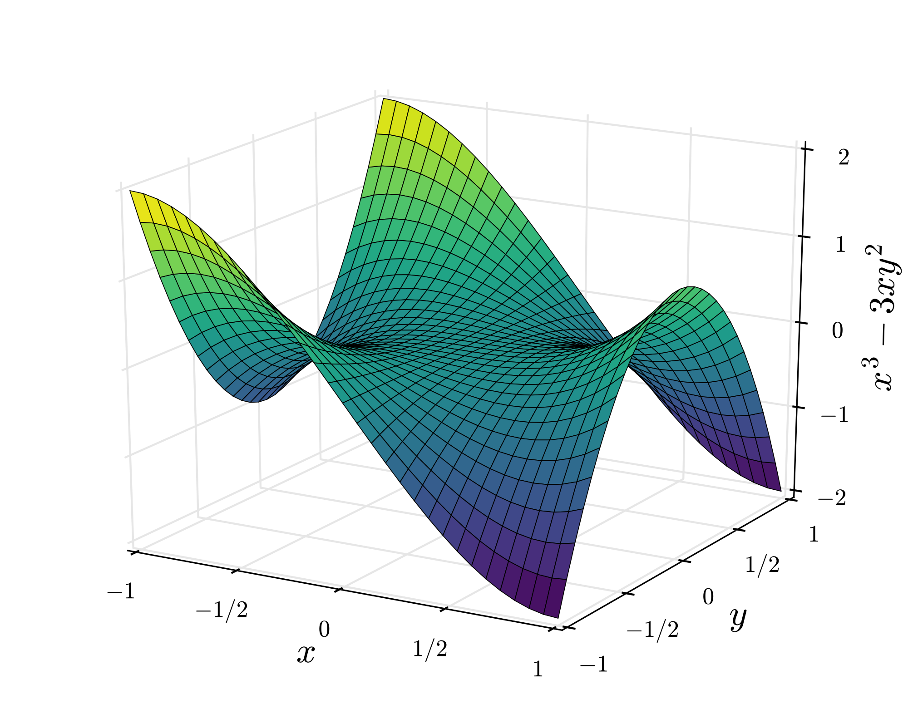

이렇게 어느 지점에 잘못 다다르는 문제도 있지만 다른 문제도 있습니다.

<br/>

### 길 헤매기


모든 데이터를 다 한꺼번에 고려한 후 1스텝을 가는 BGD가 SGD보다 더 최적의 루트(혹은 좋은 오솔길)로 산을 내려가게 됩니다. 그에 반해 결국 SGD도 적당한 곳으로 잘 내려가긴 하지만 다른 곳도 좀 헤매면서 내려갑니다. 여기서도 이미 SGD가 Mini-batch를 구현하고 있어서 update 횟수가 BGD보다 그렇게 많지 않습니다. 극단적인 예시를 위해 아래 그림을 보면 정의 그대로의 SGD가 얼마나 많은 업데이트를 하고 있는지 알 수 있습니다.

 


이처럼 SGD, Mini-batch GD가 굉장히 헤매면서 가는 것을 알 수 있습니다. 이 헤매는 것을 어떻게 하면 좀 줄일 수 있을까, local minimum이나 saddle point에 어떻게 하면 안주하지 않게 할 수 있을까 이런 질문들에서 다른 여러 optimizer들이 등장합니다. 이에 대해서는 다음 글에서 다루겠습니다.


# 개선된 Optimizers

여러 optimizer들은 어떤 부분이 개선된 것인지 살피기에 앞서 gradient descent 방법에서 무엇이 중요한지 짚고 넘어가겠습니다.

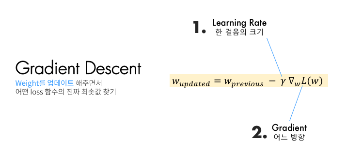

이 두 가지가 중요한데, 지금부터 살펴볼 optimizer들은 이 두 가지를 어떻게 적절하게 조금씩 손 보는지에 따라 다른 이름을 갖습니다. 우선 **어느 방향**으로 갈지에 대해 더 고민해본 optimizer들부터 살펴보겠습니다. 

  

## 어느 방향으로 갈지

SGD에도 문제점이 있습니다. 아래 타코빵 모양 같은 U자형 곡면이면서 밑면 가운데에 움푹 파인 지점이 있는 길을 따라 SGD로 공을 내려가게 하고 싶다고 생각해보겠습니다.

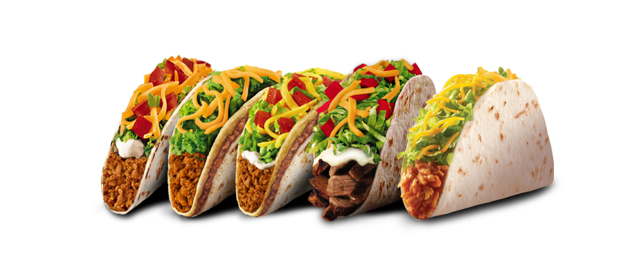

그러면 어떻게 될까요? 밑면은 기울기가 완만하고, 옆면은 기울기가 굉장히 가파른 상황입니다. 옆면의 기울기가 큰 방향으로 이동을 하면서 왔다갔다 하면서 밑면의 움푹 파인 optimum을 향해 갈 것입니다. 하지만 저희가 원하는 길은 그런 것이 아닙니다. 우리는 옆면을 많이 왔다갔다 하는 것이 아니라 밑면 가운데의 움푹 파인 곳을 향해 가기를 바랍니다. 이때 등장하는 개념이 바로 **momentum**입니다.

<br/>

### Momentum

새로운 개념이 등장합니다. 특별히 어려운 것이 아닙니다. 우리말로 번역을 하면 "관성" 즈음 되겠습니다. 우리가 weight를 업데이트를 할 때 이전에 내려왔던 방향도 반영을 해주자는 의미입니다. 다시 이전 SGD를 살펴보겠습니다.


$$
w_{t+1} = w_t - \gamma \cdot \nabla L(w_t)
$$
이렇게 기존 weight에 특정 방향의 vector( $- \gamma \cdot \nabla L(w_t)$ ) 만큼을 더해주고 있습니다. 그런데 momentum 방식은 단순히 지금 현재의 gradient를 update vector로 보자는 것이 아니라, 이전 step에서의 update vector도 고려하자는 의미입니다. 한 마디로 말해 이전에 움직였던 방향($v_t$)도 어느정도($\rho$ [^1]) 고려해서 이번에 움직이자($-\gamma \cdot v_{t+1}$)는 의미입니다. 이를 수식으로 표현하면 아래와 같습니다. 


$$
v_{t+1}=\rho v_t + \nabla L(w_t) \\
w_{t+1} = w_t - \gamma \cdot v_{t+1}
$$
이 식에서 눈여겨 봐야할 점은 이 momentum 식이 통계학에서 EMA(Exponential Moving Average) 또는 EWMA(Exponential Weighted Moving Average)로 불리는 형태로 표현될 수 있다는 점입니다. 우리나라 말로는 지수평균이라고 부르는 것 같습니다. $v_0=0$이라고 놓고 각 $v_n$을 다 더하는 꼴로 푼 다음 $\sum$으로 묶으면 이렇습니다. 이렇게 표현될 수 있다는 거는 기억해두면 나중에 써먹을 곳이 생깁니다.


$$
v_t=\sum_{i=0}^t \rho^{t-i}\nabla L(w_i)
$$


코드로 표현하면 이렇습니다.

```Python
current_gradient=evaluate_gradient(w)
vector= rho * vector + current_gradient
weight = weight - learning_rate * vector
```

<br/>

이렇게 이전에 움직였던 방향도 고려를 해주는데 대개 $\rho$ 는 0.9 언저리의 값으로 합니다. 이전에 갔던 방향도 계속 더해주기 때문에 속력이 아닌 속도(velocity)가 계속 붙습니다. 위의 공(ball) 비유로 들자면 공이 점점 내려가면서 속도가 붙습니다. 이런 점 덕분에 local minimum이나 saddle point에 걸리더라도 velocity로 그 영역을 탈출할 수 있습니다. 뿐만 아니라, 특정 방향으로 자주 update가 이루어진다면, 그 방향에 velocity가 생겨서 지그재그로 왔다갔다 하는 상황에서도 velocity 덕분에 오른쪽 아래 그림처럼 앞으로 나아가며 지그재그도 상쇄가 가능합니다. 

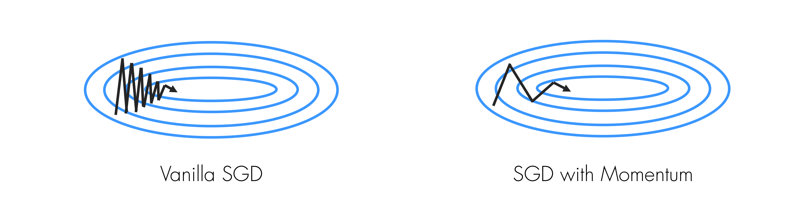

그런데 질문이 생길 수도 있습니다.

<br/>

> 만약 굉장히 좁고 가파른 minima가 있을 경우엔 velocity 때문에 거기는 그냥 지나칠 수 있게 되지 않을까?

<br/>

CS231n 강의에 따르면 사실 그런 좁고 가파른 minima에는 오히려 도달하는 것이 좋지 않을 수 있습니다. 왜냐하면 그런 좁고 가파른 minima에 도달하는 것은 overfitting이 될 수도 있기 때문입니다. 만약에 우리가 트레이닝셋을 2배로 늘려서 다시 학습을 할 경우에는 이 optimization 지형이 아예 바뀌어서 그때는 이 좁고 가파른 minima가 아예 사라져있을 수 있습니다. 좀 더 평평한 minima에 도달하는 것이 더 일반화 가능성도 높고, 탄탄할 것입니다.

이렇게 간단한 방법으로 앞에서 살펴본 꽤 많은 문제들을 어느 정도 해결할 수 있습니다. 이런 momentum 방법을 좀더 개선시킨 알고리즘도 있습니다. Nesterov라는 학자가 고안해낸 것에서 이름을 딴 Nesterov Momentum입니다.

<br/>

#### Nesterov Momentum

우리가 방금 봤던 momentum 방식과 약간 다른 방식으로 update가 이루어집니다.

<br/>

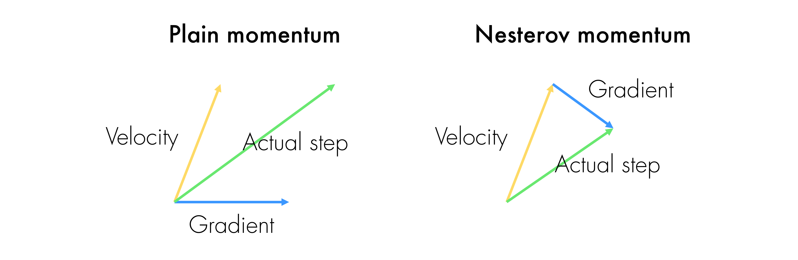

이전의 momentum update는 이런 방식이었습니다.

* **현재 위치**에서의 gradient를 구한다
* 이전 velocity를 가져온다
* 이 두 가지 방향을 더한 방향으로 한 step 간다

<br/>

하지만 Nesterov momentum은 좀 다릅니다.

* 이전 velocity를 가져온다
* 이전 velocity 방향대로만 갔을 때의 지점에서 gradient를 구한다
* 이 두 가지를 더한 방향으로 한 step 간다

<br/>

언뜻 보면 두 가지가 별 차이가 없게 느껴집니다. 하지만 그냥 momentum 방법에서는 **현재 상황에서의** gradient로 velocity가 잘못된 방향으로 갔을 경우를 대비해 미리 예방하는 느낌이라면, Nesterov momentum 방법은 velocity로 잘못된 방향으로 간 후에 그 상황에서 그것을 gradient로 대처하는 느낌입니다. CS231n에서 말하기를 신경망과 같은 non-convex function에서는 효과가 그렇게 좋은지는 모르겠다고 합니다.

   

## 한 걸음에 얼만큼 갈지

우리가 optimum에 다다르고 있는데 그냥 지나치게 되는 경우도 발생할 수 있습니다. 왜냐하면 local minimum에 다가가는 상황임에도 아무래도 learning rate가 늘 일괄적으로 적용되고 있기 때문입니다. 그래서 learning rate를 좀더 가변적으로 적용하자는 아이디어인 Adagrad가 나옵니다.

<br/>

### Adagrad

Adagrad라는 알고리즘은 한 마디로 요약하자면, 여태까지 많이 가보지 않았던 방향보다는 많이 갔던 방향에 대해 그 영향력을 점점 줄여나가는 방식입니다. 코드로 살펴보는 게 오히려 이해가 편할 수도 있겠습니다.

```python
current_gradient=evaluate_gradient(x)
grad_squared=grad_squared + current_gradient**2
weight= weight - learning_rate * current_gradient /(np.sqrt(grad_squared) + 1e-8)
```

우선 현재 위치에서의 기울기를 구하고 이를 (element-wise)제곱한 값을 `grad_squared` 에 계속 누적하는 식입니다. 어떻게 보면, `grad_squared`는 일종의 gradient 히스토리라고 볼 수 있겠습니다. 그리고는 `learning_rate` 를 이것의 제곱근으로 나눕니다.  `grad_squared` 안에서는 여태까지 가파르던 방향(n차원 공간 속에서의 한 방향)은 값이 클 것이고, 완만했던 방향은 값이 작을 것입니다. 그렇기 때문에 이것으로 `learning_rate` 를 나눠주어 scale할 경우(작은 $\epsilon$ 을 더하여 분모가 0이 되는 것을 방지합니다), 분모의 크기에 따라 `learning_rate`도 다 달라집니다. 여태까지 가파르던 방향의 learning rate는 상대적으로 작아지고, 완만했던 방향은 learning rate는 상대적으로 커집니다. 이렇게 하는 데에 대한 직관은 [*원 논문*](http://www.jmlr.org/papers/volume12/duchi11a/duchi11a.pdf) 일부분을 발췌하여 강조 표시하였습니다.

<br/>

>*Informally, our procedures give frequently occurring features very low learning rates and infrequent features high learning rates, where the intuition is that **each time an infrequent feature is seen, the learner should “take notice.”** Thus, the adaptation facilitates finding and identifying very predictive but comparatively rare features.*

<br/>

위의 코드를 이제 수식으로 옮겨보겠습니다. 이제는 한결 수식이 더 잘 읽힙니다. 


$$
G_{t+1} = G_{t} + (\nabla L(w_t))^2 \\
w_{t+1}= w_t - \frac{\gamma}{\sqrt{G_{t+1}+\epsilon}} \cdot \nabla L(w_t)
$$
이 식을 따를 때, 만약 시간에 따라서 한 step의 크기는 어떻게 될지 생각해보겠습니다. $G$ 는 계속 점점 커져만 갑니다. 이에 따라 step의 크기는 점점 작아집니다. 이런 성질이 convex function에서는 좋습니다. 왜냐하면 점점 minima에 가까워지면서 느려져야 하기 때문입니다. 그렇지만 non-convex한 경우에는 그다지 효과적이지 않을 수 있습니다. 왜냐하면 saddle point에 갇힐 수 있기 때문입니다. 이를 고치기 위해 우리 친숙한 Geoffrey Hinton이 만든 RMSProp알고리즘이 나옵니다[^2]. 덧붙여 이야기하자면, Adagrad는 learning rate를 다른 알고리즘보다는 좀 더 크게 주어야 진행이 너무 더디지 않습니다. 

<br/>

### RMSProp

RMSProp(Root Mean Squared Prop)의 아이디어는 간단합니다. Gradient 히스토리도 마치 위에서 봤던 momentum처럼 decay하게 하자는 아이디어입니다. 이번에도 코드를 먼저 살펴보겠습니다.

```python
current_gradient=evaluate_gradient(x)
grad_squared=decay_rate * grad_squared + (1 - decay_rate) * current_gradient**2
weight= weight - learning_rate * current_gradient /(np.sqrt(grad_squared) + 1e-8)
```

위의 Adagrad 방법에서 딱 1줄 달라졌습니다(사실 3줄 중에 1줄이면 많이 달라지긴 한 거네요). `decay_rate` 을 두어 기존에는 그대로 누적되던 것들을 조금씩 decay하게 만듭니다. Hinton 교수에 의하면 `decay_rate` 는 0.9, `learning_rate` 는 0.001로 하는 것이 디폴트로 괜찮은 것 같답니다. RMSProp의 수식도 달라지는 것이 크게 없습니다. 코드 내용 그대로입니다.


$$
G_{t+1} = \beta \cdot G_{t} + (1-\beta)\cdot (\nabla L(w_t))^2 \\
w_{t+1}= w_t - \frac{\gamma}{\sqrt{G_{t+1}+\epsilon}} \cdot \nabla L(w_t)
$$


## Adam

흔히 어떤 두 개의 좋은 것이 있다면, 그 두 가지를 한 데 합치는 방식이 등장하곤 합니다. Optimizer도 예외는 아닙니다. 그렇게 momentum과 gradient 히스토리 모두를 고려하는 방식이 등장하였는데, 바로 Adam입니다. 이름에서부터 Adagrad + Momentum 이라는 느낌이 묻어납니다. 코드를 보겠습니다.

<br/>

```Python
first_moment=0
second_moment=0

for t in range(m):
	current_gradient=evaluate_gradient(x)
    
	first_moment=beta1*first_moment + (1-beta1)*current_gradient
	second_moment=beta2*second_moment +(1-beta2)*current_gradient**2
	
	unbiased_first=first_moment / (1-beta1**t)
	unbiased_second=second_moment / (1-beta2**t)
	
	weight=weight-learning_rate * unbiased_first / (np.sqrt(unbiased_second)+1e-8)
	
```

<br/>

우선 7번째 줄은 우리가 앞서 봤던 momentum과 비슷합니다. 그리고 8번째 줄은 gradient 히스토리와 같은 식입니다. 이 둘을 적당히 버무린 것입니다. 그리고 각각 다른 파라미터인 `beta1`, `beta2` 를 주었습니다. 그런데 10,11번째 줄에 못 보던 코드가 들어있습니다. 이는 우리가 처음에 굉장히 큰 폭으로 step을 밟는 것을 방지하기 위함입니다. 왜냐하면 초반에 우리의 `first_moment`와 `second_moment`가 0에 가까운 값으로 bias되어 있을 것이기 때문입니다. 그리고는 이 unbiased된 것들로 실제 step을 갑니다. 왜 이렇게 되는지는 [원 논문](https://arxiv.org/pdf/1412.6980.pdf)에 나와있는데, 여기서 우리가 저 앞에 momentum을 EMA의 관점으로 바라보는 것이 필요합니다. 자세한 내용은 논문을 참조하기 바랍니다. 

Adam은 굉장히 좋은 optimizer입니다. CS231n에서 Justin Jonhson도 말했듯이, **요즘 거의 디폴트로 사용되고 있는 optimizer**입니다. 처음에 어떤 모델이든 학습을 시작해볼 때 시도하기에 좋은 수치값을 강의에서 말해주고 있을 정도입니다.

* `beta1` = 0.9
* `beta2` = 0.999
* `learning_rate` = 1e-3 or 5e-4


## 정리

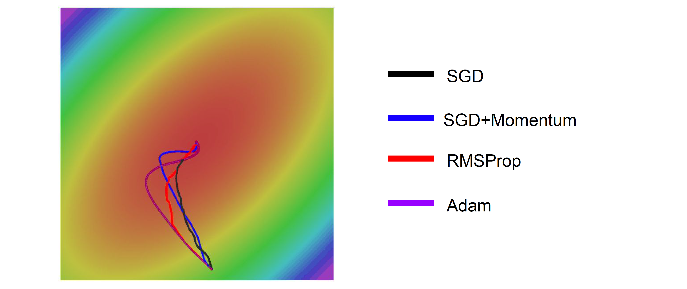

가운데의 optimum을 향해 여러 optimizer들이 달린 결과입니다. 보다시피 SGD가 가장 optimal route를 보여주고 있습니다. 하지만 SGD는 굉장히 연산량이 무겁고 힘들기 때문에 실전에서는 사용하기 힘듭니다. 그대신 나머지 3가지 optimizer들이 대안으로 존재합니다. SGD+Momentum과 Adam은 처음에는 optimum을 지나쳤다가(overshoot) 다시 돌아옵니다. 이는 알고리즘의 단점이 아니라 의도된 특성입니다. 다시 되짚어보면 이는 velocity로 인해 그런 것입니다. 그래야 sharp minima는 지나치고 local minima나 saddle point에 갇히지 않을 수 있습니다.

이 이외에도 NAdam이라 해서 앞서 봤던 Nesterov Momentum을 가미한 Adam이나, second-order optimization 기법들까지 다양하게 더 많습니다. 이렇게 여러 optimizer들이 존재하지만 디폴트로 가장 많이 쓰이는 것은 Adam입니다. 어떤 optimizer를 쓸지 모르겠다면 우선 **Adam**을 먼저 써보는 것을 추천합니다. 


[^1]: '로'라고 읽습니다
[^2]: 한 가지 재미있는 점은 구글에서 찾아보면 RMSProp의 PDF파일이 피인용수 7회라고 나옵니다. 그 이유는 Hinton 교수가 이런 새로운 알고리즘을 논문이 아닌 Coursera 강의에서 공개했기 때문입니다. 그래서 Google scholar에서 해당 강의는 피인용수가 800회가 넘습니다.